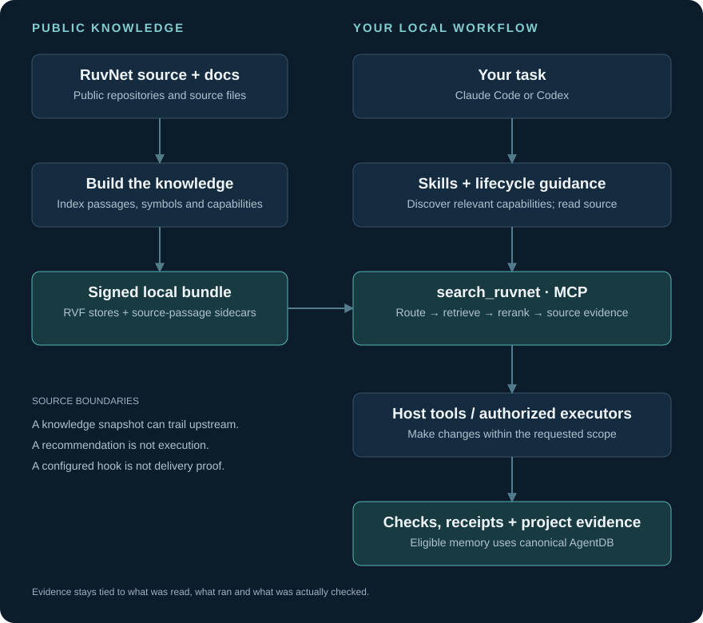
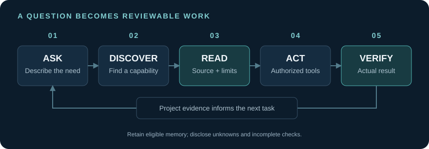

Updated: 2026-10-10 10:41:47 EDT | Version 4.6.2
Created: 2026-06-29 22:36:38 EDT

<div align="center">


# 🧠 RuvNet Brain

### Discover the stack. Read the source. Build with confidence.

[](plugin/.claude-plugin/plugin.json)

**A source-grounded companion for Claude Code and Codex that helps you find and use Reuven Cohen's (rUv's) RuvNet ecosystem.**

[](https://www.npmjs.com/package/ruvnet-brain)
[](https://github.com/stuinfla/ruvnet-brain/releases/latest)
[](https://isovision.ai/ruvnet-brain/)
[](LICENSE)

### [▶ Explore the visual walkthrough](https://isovision.ai/ruvnet-brain/)

[](https://isovision.ai/ruvnet-brain/)

<sub>Built by **Stuart Kerr** at **Isovision.ai** · open source · MIT licensed</sub>

</div>

The RuvNet ecosystem spans agent orchestration, vector search, memory, model routing,
testing and more. Finding the right building block is often harder than writing the first
line of code. Brain puts the source within reach of your coding assistant and helps it
recognize capabilities you may not yet know to ask for.

**Ask for the outcome you want. Brain helps connect it to the real tools and code.**

> **Our north star:** useful capability discovery. A good answer should explain what helps,
> why it fits, where it is implemented, and what remains unproven. Retrieval supports that
> conversation; the goal is helping you build.

[Get started](#get-started) · [Try it](#try-it-on-your-next-task) ·
[How it works](#how-it-works) · [Capabilities](#what-brain-brings-to-your-workflow) ·
[Updates](#stay-current) · [Evidence](#evidence-and-honest-limits)

## What is Brain?

Brain brings three things together:

- **A local knowledge bundle** built from public RuvNet source and documentation, with
  searchable passages, source paths, implementation bodies, symbols and capability cards.
- **A coding companion** delivered through native Claude Code and Codex plugins: the
  `search_ruvnet` MCP tool, skills and lifecycle hooks that encourage source-grounded work.
- **A local control panel**, the RuvNet Brain Console (RNBC), for inspecting your installed
  environment, choosing supported settings and seeing what actually ran.

It gives the assistant a practical way to read the stack instead of relying on remembered
APIs. You can ask by product name, describe a problem, or ask where a capability is
implemented. Results identify the repository and file so the answer can be checked.

**You keep control.** Recommendations, saved settings, executed tools and verified outcomes
are different things. Brain's evidence surfaces are designed to show those differences.

## Get started

You need Node.js **18 or newer**, npm, and a supported Claude Code or Codex installation.
Run the installer from your terminal:

```bash
npx ruvnet-brain@latest
```

The installer downloads the signed public knowledge bundle, installs its local reader and
configures the supported hosts it detects. The default Brain home is
`~/.cache/ruvnet-brain`; the knowledge bundle lives in its `kb/` directory. Follow the
installer's host/trust instructions and restart when it reports changed plugin declarations.

Local knowledge retrieval does not require an external embedding API or its API key.
Installation and updates download dependencies and release artifacts; your coding host and
any optional model providers retain their own account and billing requirements.

**Then ask your assistant:**

```text
How does Ruflo coordinate agents? Show the source that implements it.
```

Open the Console in Claude Code or Codex with **`/rnbc`** (also **`/rnb`**). It opens a local
page and scans your environment. Actions explain their effect before you apply them.

For an installed command, inspect the actual installation:

```bash
ruvnet-brain --doctor
```

If you used the one-shot installer and have no `ruvnet-brain` command on your PATH, use
`npx ruvnet-brain@latest --doctor`. Keep routine updates on the installation's existing owner
and path; see [stay current](#stay-current).

> The installer and local search support macOS, Linux and Windows. Hook delivery and optional
> executors depend on the host, OS and installed tools. Use `--doctor` and actual task receipts
> to inspect your environment; a registered hook or tool alone does not establish delivery.

## Try it on your next task

You do not need to know the repository names first. Start with a concrete need:

- **Find a building block:** “I need persistent memory for my agents. Which RuvNet options
  fit, and where are their APIs implemented?”
- **Understand a mechanism:** “Show me how RVF stores and queries vectors. Cite the source,
  and separate working implementation from design documents.”
- **Plan with evidence:** “Compare the RuvNet approaches for routing model calls. Explain
  the tradeoffs before recommending one.”
- **Improve a codebase:** “Review this project's agent workflow. Identify a useful capability
  we already have, then propose the smallest change and how we would verify it.”
- **Build with a bounded request:** “Use `/brain-build` to add a read-only report to this app,
  keep existing data intact, and verify the rendered result.”
- **Resume work:** “Come up to speed on this project: what changed, what is still open,
  and which decisions have source or test evidence?”

These are starting prompts, not promises of a particular result. Ask the assistant to cite
what it read, say which tools executed, and name any missing prerequisite. Optional routing
requires available, authorized executors; recommendations do not automatically install tools
or authorize spending.

## How it works

Brain separates **building the knowledge**, **retrieving evidence**, and **acting on it**.
Public source is indexed into local RVF stores. At query time, the reader combines routing
and retrieval lanes, reranks candidates and returns source evidence through MCP. The coding
host uses that evidence while its own tools perform the work.



<details>
<summary>ASCII Version (for AI/accessibility)</summary>

```text
PUBLIC KNOWLEDGE                      YOUR LOCAL WORKFLOW
RuvNet source + docs                  Your task in Claude Code / Codex
          |                                         |
          v                                         v
Index source + symbols                Skills + lifecycle guidance
          |                                         |
          v                                         v
Signed public bundle ---------------> search_ruvnet (MCP)
Local RVF stores + source passages    Route -> retrieve -> rerank
                                                    |
                                                    v
                                      Source evidence: repo + path
                                                    |
                                                    v
                                      Host tools / authorized executors
                                                    |
                                                    v
                                      Changes + checks + receipts
                                      Eligible project memory (AgentDB)
```

</details>

The reader uses per-repository knowledge, capability cards, lexical and vector retrieval,
and a shared cross-encoder ranking lane. It labels evidence and checks implementation
requirements for queries that ask for code. A capability card helps find a product;
it does not by itself prove an implementation exists.

The public bundle contains RVF knowledge stores and source-passage sidecars. Project history
is separate: eligible capture and recall use the project's canonical AgentDB store, including
worktree resolution. Consent and failure reporting apply at those boundaries.

**Source:** [retrieval implementation](kb/forge-ask-all.mjs),
[MCP server](plugin/mcp/server.mjs), [Claude hooks](plugin/hooks/hooks.json),
[Codex hooks](plugin/hooks/codex-hooks.json).

## What Brain brings to your workflow

**Discover capabilities.** Ask about a need in plain language and get a starting point in the
RuvNet ecosystem. Source-grounded advocacy aims to surface relevant capabilities early,
with a reason they fit your task.

**Read implementation.** Search results can include code bodies and source documents, with
repository/path labels and evidence metadata. Evidence class matters: a design proposal and
an implementation answer carry different weight.

**Guide work across hosts.** The plugins share grounding and workflow skills while native
hook adapters account for Claude Code and Codex differences. `/brain-prompt` helps refine a
rough idea; `/brain-build` supplies a structured build contract. Configured routing can hand
bounded work to supported native executors and record the choice. Routing registration is
separate from observing a worker execute.

**Retain useful project context.** Where an eligible project store and consent permit it,
lifecycle capture records bounded, redacted observations and outcomes. Recall brings project
facts and lessons back as evidence. Pending writes and incomplete restoration stay visible;
inferred lessons do not silently become authoritative user instructions.

**Inspect and maintain your environment.** RNBC shows installed components and supported
settings. The coordinated updater uses one policy and shared owner lock for manual and
scheduled runs, preserving existing managers and install paths.

**Make proof part of the conversation.** Doctor, grounding receipts, update receipts and
release gates distinguish a configured capability from an observed result. They help you
identify the next check rather than infer success from a green registration line.

### Explore the ecosystem through Brain

Ask about **Ruflo** for coordination, **RuVector / RVF** for vector knowledge,
**AgentDB** for agent memory, **agentic-flow** for agent/model workflows,
**Agentic QE** for quality engineering, or **SPARC** for a structured development method.
Then deepen the answer with “show the implementation and prerequisites.” The bundle covers
many more public repositories; its release census and source metadata define its coverage.

## From a question to reviewable work



<details>
<summary>ASCII Version (for AI/accessibility)</summary>

```text
ASK          DISCOVER       READ          ACT          VERIFY
Your need -> Relevant    -> Source     -> Authorized -> Actual result
             capability     + limits      host tools    + limitations
                               ^                             |
                               |                             v
                         Next task <---------------- Project evidence
                                                     eligible memory
```

</details>

Start with the problem. Check the recommendation against its source. Make the change within
the requested scope. Inspect the actual result, then retain useful evidence for the next task.
The same sequence works for an explanation, a small repair or a larger delegated build.

## Stay current

**4.6.0 introduces coordinated installed-tool updates.** Open RNBC and choose
**Keep all tools updated**, with **Latest (recommended)** or **Alpha**. The default scope is
the installed RuvNet suite; broader developer-tool maintenance is an explicit choice.
Manual and scheduled runs share the coordinator, saved policy and owner lock.
The schedule is **03:30 in your local time**.

```bash
ruvnet-brain-update --check
ruvnet-brain-update --apply
```

Inspect the run receipt for what changed, failed or was excluded. A saved preference or a
registered schedule establishes configuration; a completed run establishes its outcome.
For an existing Brain installation, `ruvnet-brain --update` uses the update path.
`ruvnet-brain --disable-nightly` disables its scheduled updates.

**Code version and knowledge freshness are separate.** A code release can package the last
published corpus without having refreshed every upstream repository. Public corpus production
uses the protected release workflow; a consumer update downloads an available generation and
does not rebuild upstream knowledge. Check `--doctor`, `SOURCE.json` and refresh receipts
before treating an installation as current.

The **4.6.0 published-corpus baseline** is **199 public stores · 162,680 public source chunks**.
Those are bundle census values, not a claim that every upstream repository is fresh today.
Later corpus publication may advance the knowledge generation independently of code changes.

See [4.6.2 native update repair notes](docs/RELEASE-NOTES-4.6.2.md),
[4.6.1 README/admin notes](docs/RELEASE-NOTES-4.6.1.md) and
[4.6.0 coordinated-update notes](docs/RELEASE-NOTES-4.6.0.md) and the authoritative
[update and release policy](CONTRIBUTING.md).

## Evidence and honest limits

Brain supplies mechanisms and evidence; every claim has a boundary:

- **Grounding guides the assistant.** Hooks and skills encourage source reads. Selected tool
  boundaries can refuse a call, but they do not guarantee the model always obeys, writes
  correct code or chooses the best design.
- **Retrieval has a snapshot boundary.** Check dates and upstream source when currency matters.
  Coverage is limited to the indexed public material; the private-store fence excludes
  designated private stores from public bundles.
- **Local search and model execution have different costs.** The reader runs locally;
  your host and optional provider calls may be metered. Brain does not claim automatic model
  switching or savings from merely registering a route.
- **Memory has consent and delivery boundaries.** Queued capture is not committed history.
  Native delivery, exact readback and restoration require their own evidence.
- **Publication is separate from source preparation.** The protected workflow binds a release
  to its artifact and public installation checks. A README edit, local test or passing subset
  does not establish a published release.

<details>
<summary>Recorded coverage baseline and how it is checked</summary>

[-b58900?style=flat-square)](scripts/claims-verify.mjs)

This retained badge is a recorded baseline, not a new measurement from this documentation
revision. `npm run test:cov` creates the coverage artifact; `npm run claims:verify` checks the
advertised number against the source-bound artifact. A new release must rederive its claims.
Historical routing percentages and test totals are deliberately absent from this overview:
their original runs do not establish the current candidate's behavior.

</details>

## For contributors

The repository uses Node.js ESM. Start with [CONTRIBUTING.md](CONTRIBUTING.md), which owns
release, versioning, corpus and hook policies. Install checkout dependencies and run the
relevant checks:

```bash
npm ci
npm test
npm run single-source:check
npm run wired:check
```

Source and integration qualification are defined by `npm run release:qualify`; use the
current procedure and unique report paths in CONTRIBUTING. Claims, packed-artifact checks,
public installation and native-host evidence remain separate gates.

Useful places to read:

- [`plugin/`](plugin/) — native plugins, skills, lifecycle hooks and MCP shell.
- [`kb/`](kb/) — retrieval implementation and knowledge tooling.
- [`scripts/`](scripts/) — install, update, console and release checks.
- [`docs/adr/`](docs/adr/) — architecture decisions and their acceptance limits.
- [`SECURITY.md`](SECURITY.md) — security boundaries and reporting.
- [`explainer/`](explainer/) — source for the public visual walkthrough. The companion page
  is introductory; current implementation and policy are documented in this repository.

## Community and license

Have a concrete example that helped, or a source-grounded failure we can reproduce?
Open an [issue](https://github.com/stuinfla/ruvnet-brain/issues) or join
[Discussions](https://github.com/stuinfla/ruvnet-brain/discussions).

RuvNet Brain is **MIT licensed**. See [LICENSE](LICENSE).
